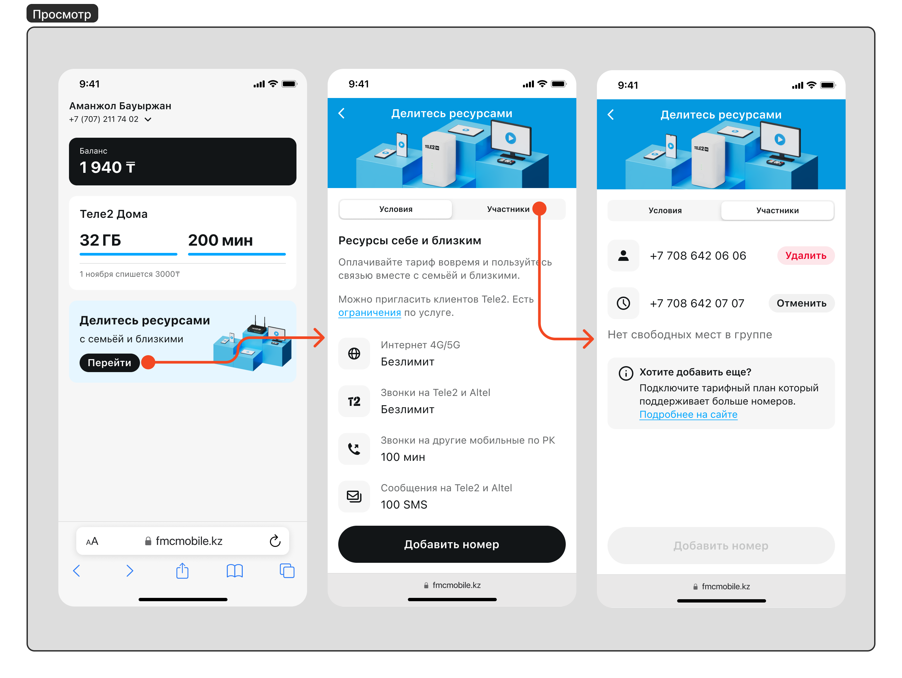
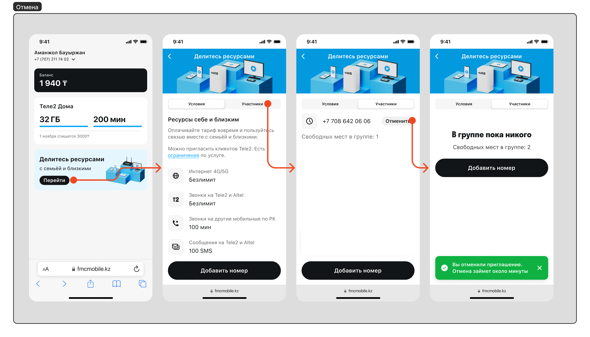
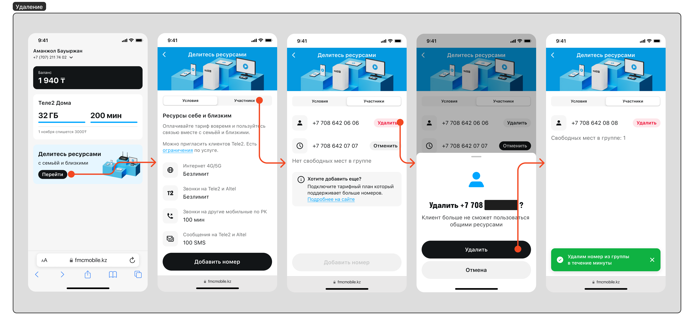

# Услуга делитесь ресурсами

### Основное описание:

- Данная услуга предназначена, чтобы делиться ресурсами своего тарифного плана с другими участниками группы. Данная услуга доступна на тарифных планах где она включена в пакет;
- Количество номеров с которыми можно делиться и объем ресурсов которые они получают ограничены тарифным планом. Актуальный список тарифов с условиями можно посмотреть на официальном сайте в разделе [Tele2 Дома](https://tele2.kz/new/tele2home);
- Клиент может самостоятельно отправить приглашение на добавление в группу;
- Клиент может самостоятельно удалить участника группы или отменить отправленное приглащение.

---

### Добавление нового участника группы:

1. **Перейти в услугу** делитесь ресурсами;
2. Нажать на кнопку **Добавить номер**;
3. **Ввести номер** телефона;
4. Нажать **Отправить приглашение**.
5. На введенный номер телефона отправится SMS-приглашение с номера 2221 в течении 5 минут;
6. Приглашенный номер должен отправить в ответ 1, чтобы принять приглашение;

---

### Просмотр участников и количества свободных мест:

1. **Перейти в услугу** делитесь ресурсами;
2. Открыть вкладку **Участники**;
3. Перед вами отображен список активных участников / отправленных приглашений и количество свободных мест. Приглашения тоже занимают место в группе.

---

### Отмена отправленного приглашения:

1. **Перейти в услугу** делитесь ресурсами;
2. Открыть вкладку **Участники**;
3. Нажать на кнопку **Отменить** возле активного пришлашения (номер телефона с иконкой часов).

---

### Удаление активного участника:

1. **Перейти в услугу** делитесь ресурсами;
2. Открыть вкладку **Участники**;
3. Нажать на кнопку **Удалить** возле активного участника (номер телефона с иконкой человека);
4. **Подтвердить** удаление номера из группы.

