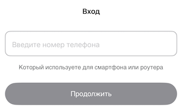
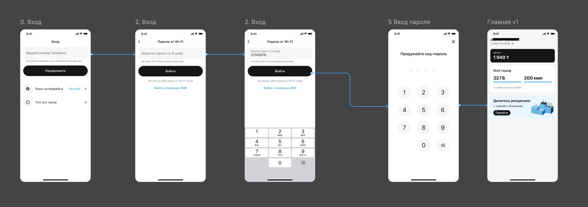
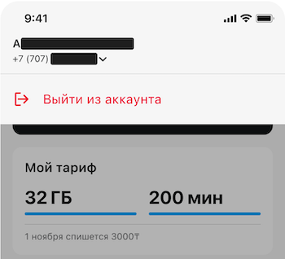

# Авторизация

Для того чтобы получить доступ в приложение, необходимо войти.

- [Авторизация](#авторизация)
  - [Вход для клиентов с проводным интернетом](#вход-для-клиентов-с-проводным-интернетом)
  - [Вход для клиентов с 5G интернетом](#вход-для-клиентов-с-5g-интернетом)
  - [Выход из аккаунта](#выход-из-аккаунта)

---

## Вход для клиентов с проводным интернетом

1. **Открыть приложение/сайт** Tele2 Дома;
2. **Ввести номер телефона** который привязан к домашнему интернету;
3. Нажать на кнопку **Войти с помощью SMS**;
4. **Ввести код** из SMS;
5. **\*Придумать Пин-код** для быстрого доступа к приложению;
6. **\*Разрешить доступ к биометрии** для быстрого входа если устройство поддерживает (Face Id или Touch Id).

> \*ВАЖНО! 5 и 6 пункты доступны только в мобильном приложении iOS / Android.

> Будет картинка FMC

---

## Вход для клиентов с 5G интернетом

1. **Открыть приложение/сайт** Tele2 Дома;
2. **Ввести номер телефона** который привязан к домашнему интернету.
3. **Ввести пароль от Wi-Fi**. Можно посмотреть на обратной стороне роутера (wi-fi key)
4. **\*Придумать Пин-код** для быстрого доступа к приложению.
5. **\*Разрешить доступ к биометрии** для быстрого входа если устройство поддерживает (Face Id или Touch Id).

> \*ВАЖНО! 4 и 5 пункты доступны только в мобильном приложении iOS / Android.

---

## Выход из аккаунта

1. На главном экране **нажать на номер телефона**.
2. Нажать **Выйти из аккаунта**.

> ВАЖНО! Если вы использовали чужое устройство, то необходимо выйти из аккаунта во избежания доступа к вашим данным посторонними лицами.

