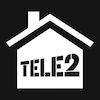

# Общее описание

### Иконка приложения Tele2 Дома

### Для кого предназначено приложение?

Для клиентов фиксированного и беспроводного домашнего интернета Tele2 Дома.

### Как воспользоваться приложением?

1. Необходимо скачать мобильное приложение или воспользоваться веб версией.
2. Авторизоваться с помощью вашего номера телефона который привязаан к домашнему интернету или находится в беспроводном 5G роутере. 

### На каких пдатформах доступно приложение?

- iOS приложение [ссылка на приложение в App Store](https://apps.apple.com/kz/app/tele2-%D0%B4%D0%BE%D0%BC%D0%B0/id6504179578) 
- Android приложение [ссылка на приложение в Google Play](https://play.google.com/store/apps/details?id=kz.tele2.fmc) 
- Веб-приложение dom.tele2.kz [ссылка на сайт](dom.tele2.kz) 

  

