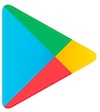

# Общее описание

## Для кого предназначено приложение:

Для клиентов фиксированного и беспроводного домашнего интернета Tele2 Дома.

## На каких платформах доступно приложение:

1. iOS приложение [ссылка на приложение в App Store](https://apps.apple.com/kz/app/tele2-%D0%B4%D0%BE%D0%BC%D0%B0/id6504179578) 
2. Android приложение [ссылка на приложение в Google Play](https://play.google.com/store/apps/details?id=kz.tele2.fmc) 
3. Веб-приложение dom.tele2.kz [ссылка на сайт](dom.tele2.kz) 

