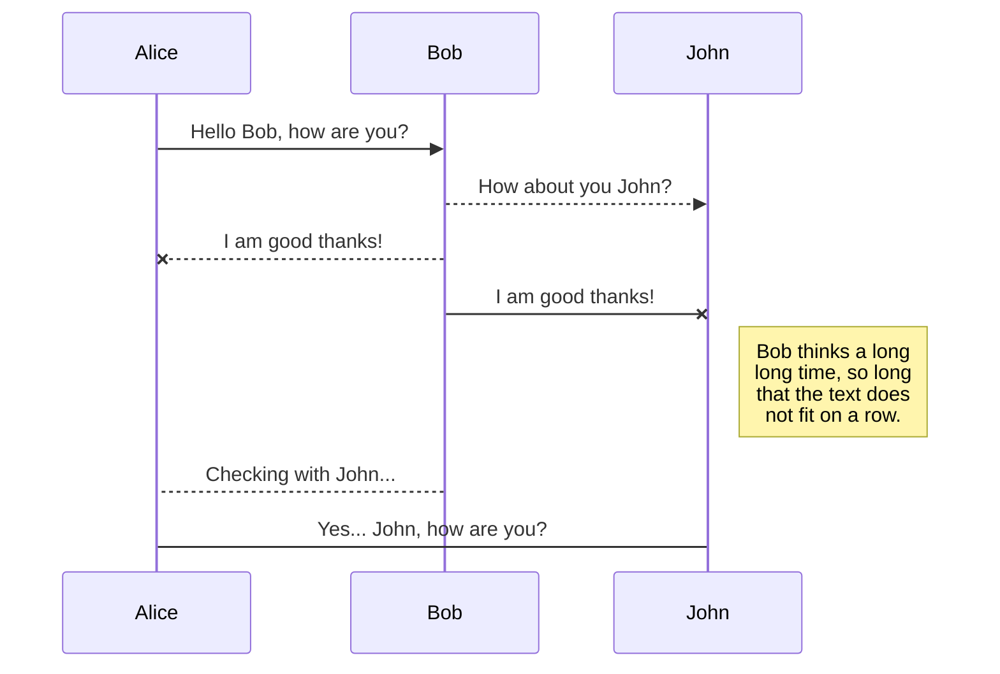

# Добро пожаловать!

### Руководство для пользователя приложения  **Tele2 Дома**

Данный сайт предназначен для описания функциональных возможностей приложения. Описание будет дополняться с выходом новых обновлений приложения.

Данный формат описания функциональных возможностей приложения носит экспериментальный характер, и содержит только общедоступную информацию.

[Общее описание приложения](/description.md)

