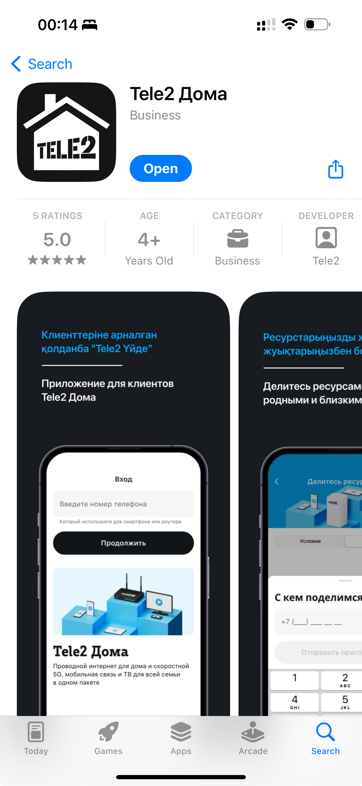

# Руководство пользователя приложения Tele2 Дома

*Страница предназначена для описания функциональных возможностей приложения Tele2 Дома. Описание будет дополняться с выходом новых обновлений приложения. Данный формат описания носит экспериментальный характер, и содержит только общедоступную информацию.*

- [Руководство пользователя приложения Tele2 Дома](#руководство-пользователя-приложения-tele2-дома)
  - [Зачем нужно это приложение?](#зачем-нужно-это-приложение)
  - [Как воспользоваться приложением?](#как-воспользоваться-приложением)
  - [Как посмотреть баланс / тариф / стоимость / дату списания?](#как-посмотреть-баланс--тариф--стоимость--дату-списания)
  - [Как воспользоваться услугой **Делитесь ресурсами**?](#как-воспользоваться-услугой-делитесь-ресурсами)

---

## Зачем нужно это приложение?

Данное приложение предназначено для клиентов Tele2 Дома. Оно позволяет:

1. Проверить баланс;
2. Узнать свой тарифный план, остатки ресурсов и следующую дату списания;
3. Управлять услугой делитесь ресурсами;
4. *Будет рсширяться функционал...*

> Приложение имеет облегченный вход для клиентов с 5G-роутером.

---

## Как воспользоваться приложением?

1. Необходимо скачать мобильное приложение Tele2 Дома или зайти на сайт:
   - iOS приложение [App Store](https://apps.apple.com/kz/app/tele2-%D0%B4%D0%BE%D0%BC%D0%B0/id6504179578)
   - Android приложение [Google Play](https://play.google.com/store/apps/details?id=kz.tele2.fmc)
   - Сайт [dom.tele2.kz](https://dom.tele2.kz)
2. [Войти](03-auth/index.md) с помощью вашего номера телефона который привязан к домашнему интернету или находится в беспроводном 5G роутере. 

---

## Как посмотреть баланс / тариф / стоимость / дату списания?

1. [Войти](03-auth/index.md) в приложение;
2. На главной странице вы сразу можете найти интересующую вас информацию.

---

## Как воспользоваться услугой **Делитесь ресурсами**?

1. [Войти](03-auth/index.md) в приложение;
2. На главной странице нажать на баннер Делитесь ресурсами;
3. Откроется страница для управления услугой, где вы можете добавить номер в вашу группу.

> [Детальное описание услуги Делитесь ресурсами](04-main-page/share-resources.md)