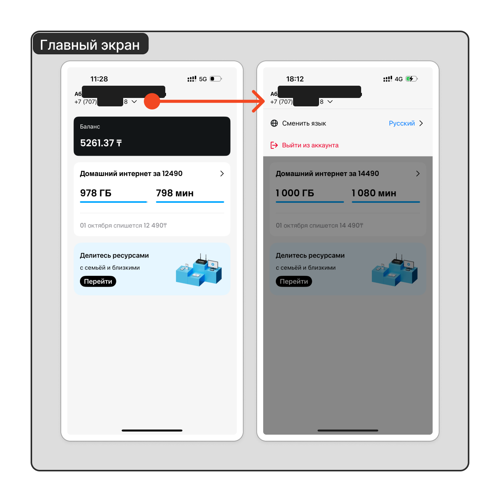

# Главный экран

## Данные клиента

- **Номер телефона** с помощью которого вошли в приложение;
- **ФИО** клиента на которого зарегистрирован номер телефона.

## Настройки аккаунта

- **Выйти из аккаунта**, чтобы выйти из авторизованной зоны;
- **Смена языка**, доступны казахский и русский языки (также есть английский системный перевод, но может быть некорректный перевод).

## Баланс

## Тарифный план

- **Наименование** тарифного плана
- **Минуты** - количество оставшихся минут на других операторов
- **ГБ** - количество оставшихся гигабайт в рамках текущего тарифного плана

## [Услуга делитесь ресурсами](share-resources.md)

