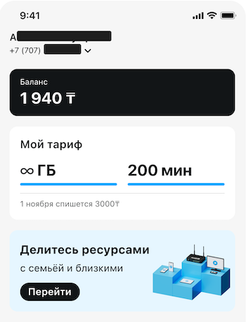

# Главный экран

## Данные клиента

- **Номер телефона** с помощью которого вошли в приложение;
- **ФИО** клиента на которого зарегистрирован номер телефона.

## Баланс

## Тарифный план

- **Наименование** тарифного плана
- **Остаток ресурсов** (гигабайты и минуты)

## [Услуга делитесь ресурсами](share-resources.md)

