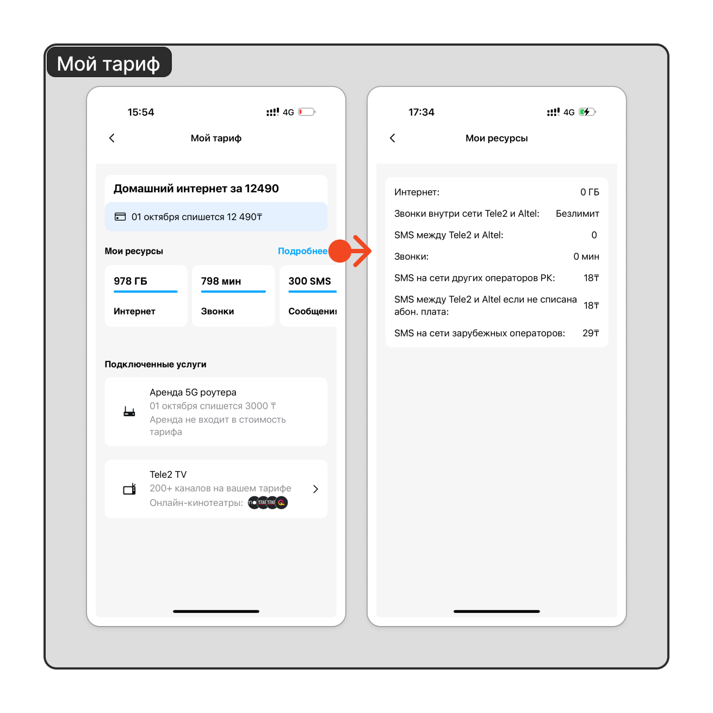

# Мой тариф

- [Мой тариф](#мой-тариф)
  - [Содержание экрана Мой тариф](#содержание-экрана-мой-тариф)
    - [Тариф](#тариф)
    - [Подключенные услуги](#подключенные-услуги)

## Содержание экрана Мой тариф

### Тариф

- Наименование тарифа;
- Следующая дата списания тарифа;
- Сумма следующего списания за тариф;
- Ресурсы по тарифу (ГБ, Минуты, SMS);
- Детали по ресурсам.

### Подключенные услуги

- Аренда 5G роутера - отображается если роутер был взять в аренду;
- [Tele2 TV](tele2tv.md) - отображается если в тарифный план включена услуга ТВ.