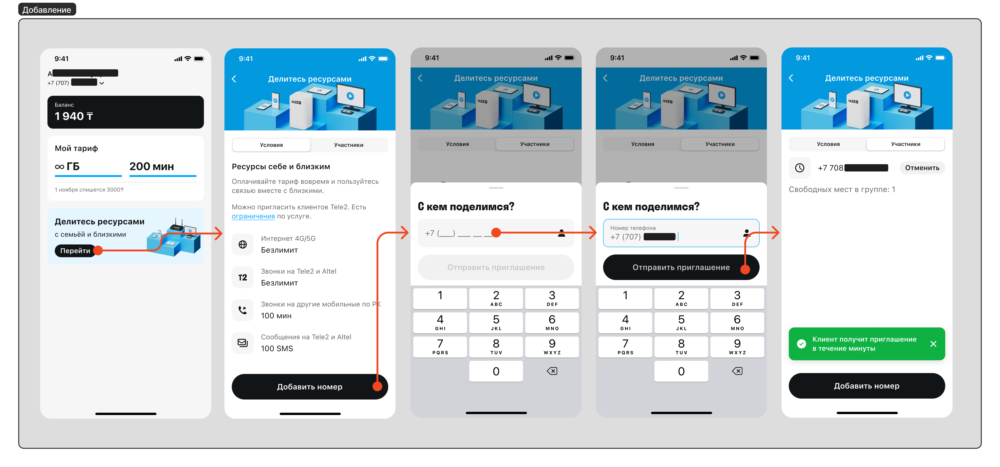
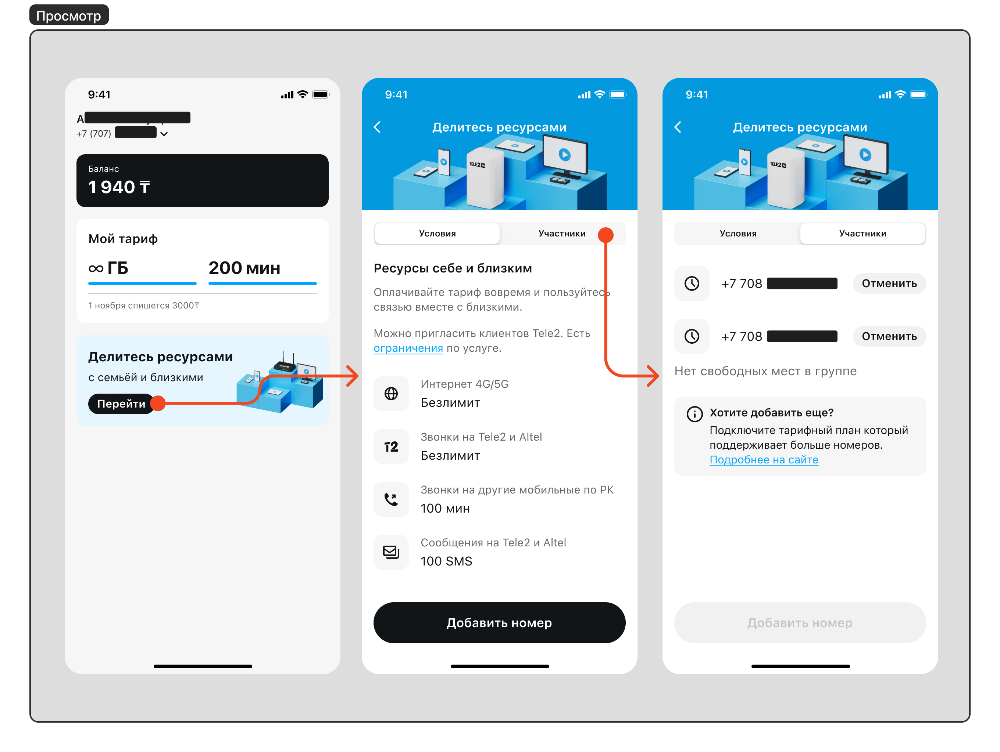
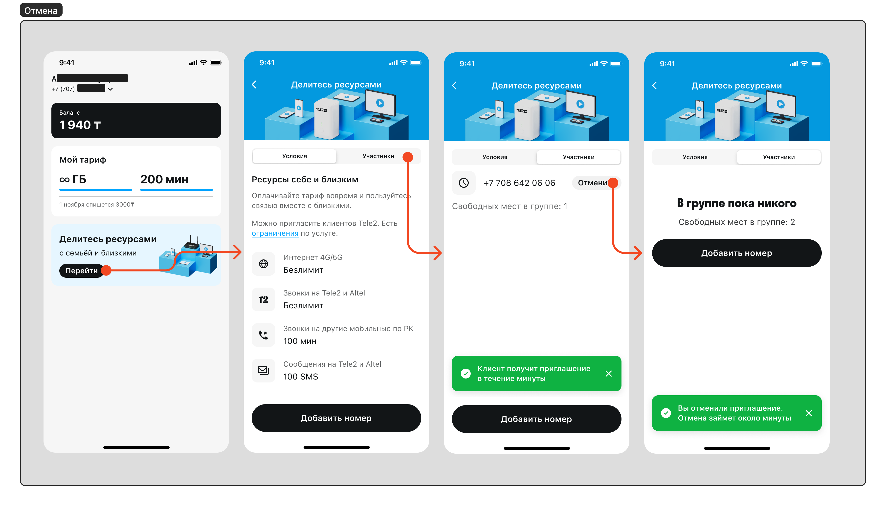
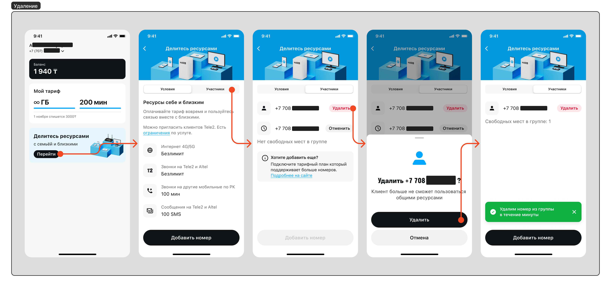

# Услуга - Делитесь ресурсами

- [Услуга - Делитесь ресурсами](#услуга---делитесь-ресурсами)
  - [Описание](#описание)
  - [Добавление нового участника группы](#добавление-нового-участника-группы)
  - [Просмотр участников и количества свободных мест](#просмотр-участников-и-количества-свободных-мест)
  - [Отмена отправленного приглашения](#отмена-отправленного-приглашения)
  - [Удаление активного участника](#удаление-активного-участника)

## Описание

- Данная услуга предназначена, чтобы делиться ресурсами своего тарифного плана с другими участниками группы;
- Данная услуга доступна на тарифных планах где она включена в пакет;
- Количество номеров с которыми можно делиться и объем ресурсов которые они получают ограничены тарифным планом. Актуальный список тарифов с условиями можно посмотреть на официальном сайте в разделе [Tele2 Дома](https://tele2.kz/new/tele2home);
- Если недостаточно свободных мест в группе, есть 2 решения:
  - Удалить участника группы;
  - Перейти на тарифный план который поддерживает больше участников.

---

## Добавление нового участника группы

1. **Перейти в услугу** делитесь ресурсами;
2. Нажать на кнопку **Добавить номер**;
3. **Ввести номер** телефона;
4. Нажать **Отправить приглашение**.
5. На введенный номер телефона отправится SMS-приглашение с номера 2221 в течении 5 минут;
6. Приглашенный номер должен отправить в ответ 1, чтобы принять приглашение;

---

## Просмотр участников и количества свободных мест

1. **Перейти в услугу** делитесь ресурсами;
2. Открыть вкладку **Участники**;
3. Перед вами отображен список активных участников / отправленных приглашений и количество свободных мест. Приглашения тоже занимают место в группе.

---

## Отмена отправленного приглашения

1. **Перейти в услугу** делитесь ресурсами;
2. Открыть вкладку **Участники**;
3. Нажать на кнопку **Отменить** возле активного приглашения (номер телефона с иконкой часов).

---

## Удаление активного участника

1. **Перейти в услугу** делитесь ресурсами;
2. Открыть вкладку **Участники**;
3. Нажать на кнопку **Удалить** возле активного участника (номер телефона с иконкой человека);
4. **Подтвердить** удаление номера из группы.

