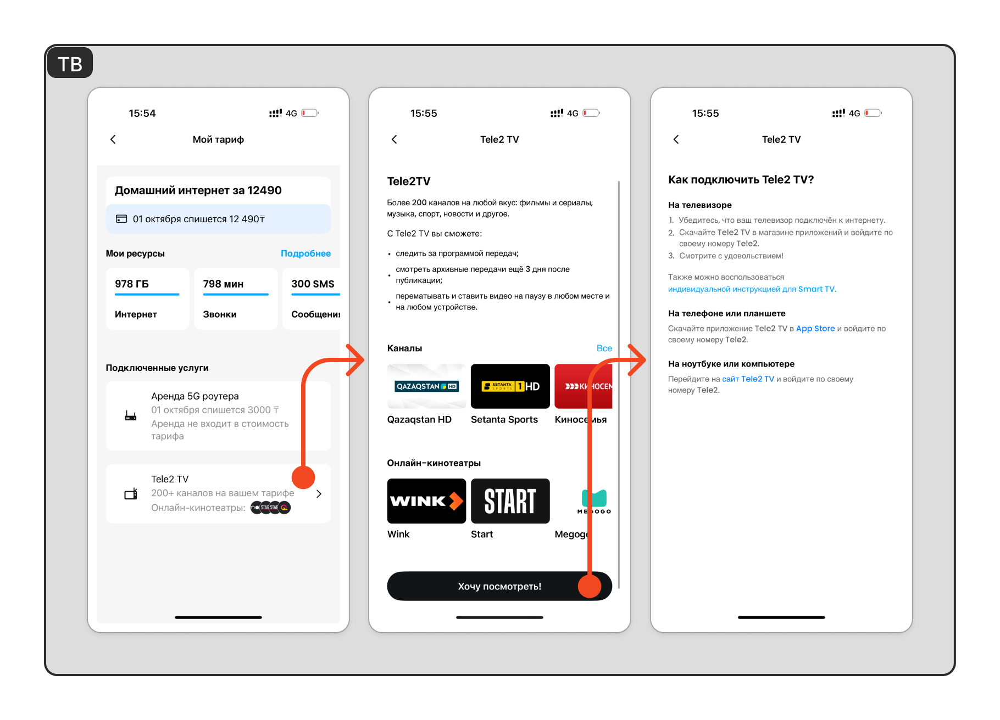

# Tele2 TV

## Описание

- Tele2 TV - это приложение для просмотра тв контента и онлайн кинотеатров;
- Если отображается данная услуга в подключенных, то значит что эта услуга подключена;
- Чтобы посмотреть инструкцию о том что входит в услугу ТВ и как ей воспользоваться, нужно нажать на блок Tele2 TV на экране Мой тариф (примеры на скринах ниже)

